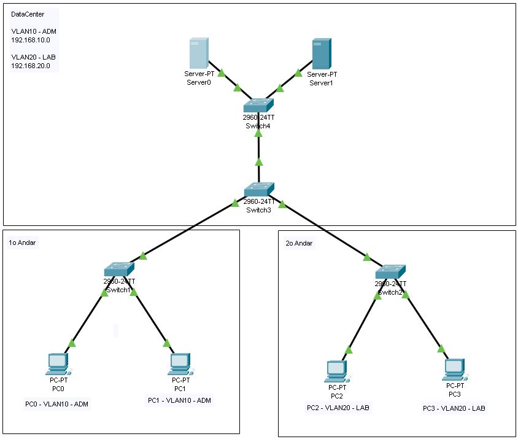
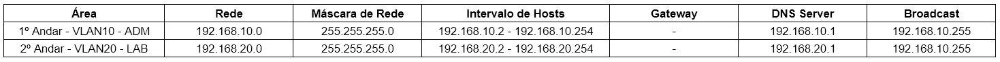

# Projeto de rede utilizando 2 servidores, 4 switchs e 4 PC - CISCO Packet Tracer

## Contextualização

Neste projeto foi feito uma segmentação de rede através de VLANs, em que foram separadas duas redes através da VLAN10 para a área de ADM e da VLAN20 para área de LAB. O projeto conta com dois switchs intermediários e dois internos. Cada VLAN teve sua distribução de hosts feitas através dos switchs internos.
Também foram integrados dois servidores para a realização do DHCP, cada um para uma VLAN específica.
Foram introduzidos e aplicados os conceitos de iPv4, Redes, Máscaras de rede, Gateway, Broadcast, PDU, Segmentação de rede, DataCenter, VLAN, DHCP e DNS Server.

## Lista dos componentes

- 2 Server-PT
- 4 Switchs 2960-24TT
- 4 PC-PT

## Projeto Lógico

## Tabela de endereçamento de IP

## Arquivo pkt

https://drive.google.com/file/d/15JhyPZgVFYyamL-dNV04IshYpwNdT5g9/view?usp=sharing
